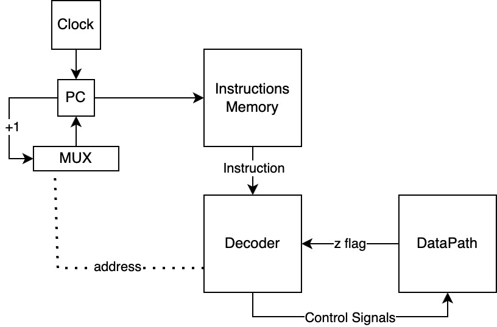
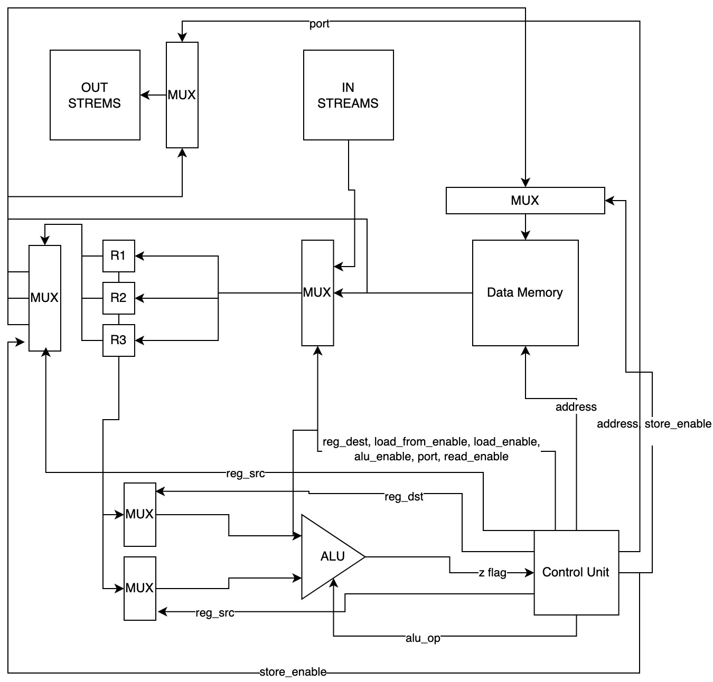

# АК: Лабораторная работа №3. Эксперимент.

- Лукьянчук Ярослав Евгеньевич P3223
- asm | risc | harv | mc | instr | binary | stream | port | cstr | prob2

---

## Язык программирования SwagLang

```bnf
<program> ::= <data_section> <text_section>

<data_section> ::= "data:" "{" {<data_definition>}* "}"

<data_definition> ::= <label> ":" <data_value> ";"

<data_value> ::= <string_literal> | <number>

<string_literal> ::= '"' {<char>}* '"'

<number> ::= <digit> {<digit>}*

<text_section> ::= "run" <block>

<block> ::= ":{" {<instruction>}* "}"

<instruction> ::= <label> ":" <block>
                | <label> ":" 
                | <command> ";"

<command> ::= "load" "[" <reg> "," <value_or_address> "]"
            | "store" "[" <reg> "," <address> "]"
            | "input" "[" <reg> "," <stream> "]"
            | "output" "[" <reg> "," <stream> "]"
            | "inputchar" "[" <reg> "," <stream> "]"
            | "outputchar" "[" <reg> "," <stream> "]"
            | "add" "[" <reg> "," <reg_or_value> "]"
            | "sub" "[" <reg> "," <reg_or_value> "]"
            | "cmp" "[" <reg> "," <reg_or_value> "]"
            | "jmp" "[" <label> "]"
            | "je" "[" <label> "]"
            | "jne" "[" <label> "]"
            | "stop"

<reg> ::= "R1" | "R2" | "R3"

<value_or_address> ::= <number> | <address>

<address> ::= <label>

<stream> ::= "!" <label>

<label> ::= <letter> {<letter> | <digit>}*

<digit> ::= "0" | "1" | "2" | "3" | "4" | "5" | "6" | "7" | "8" | "9"

<letter> ::= "a" | ... | "z" | "A" | ... | "Z"

<char> ::= <letter> | <digit> | <special_char>

<special_char> ::= "!" | "\"" | "#" | "$" | "%" | "&" | "'" | "(" | ")" | "*" | "+" | "," | "-" | "." | "/" | ":" | ";" | "<" | "=" | ">" | "?" | "@" | "[" | "\\" | "]" | "^" | "_" | "`" | "{" | "|" | "}" | "~"
```

---

## 2. Описание команд

### 2.1 Операции с регистрами и памятью

#### **`load[reg, value_or_address]`**

Загружает числовое значение или значение из памяти по указанному адресу в регистр.

**Пример:**

```asm
load[R1, 100];          // R1 = 100
load[R3, myVar];        // R3 = значение переменной myVar из секции данных
```

#### **`store[reg, address]`**

Сохраняет значение из регистра по указанному адресу памяти.

**Пример:**

```asm
store[R1, sum];         // Сохраняем значение из R1 в переменную sum
```

#### **`add[reg, reg_or_value]`**

Прибавляет значение к регистру.

**Пример:**

```asm
add[R1, 10];            // R1 = R1 + 10
add[R2, R1];            // R2 = R2 + R1
```

#### **`sub[reg, reg_or_value]`**

Вычитает значение из регистра.

**Пример:**

```asm
sub[R2, 1];             // R2 = R2 - 1
sub[R3, R1];            // R3 = R3 - R1
```

#### **`cmp[reg, reg_or_value]`**

Сравнивает значение в регистре с другим значением; результат влияет на последующие условные переходы.

**Пример:**

```asm
cmp[R1, 0];             // Сравниваем R1 с 0
cmp[R2, R3];            // Сравниваем R2 с R3
```

### 2.2 Ввод и вывод данных

#### **`input[reg, !stream]`**

Считывает числовое значение из потока в регистр.

**Пример:**

```asm
input[R2, !INPUT];      // Считываем число из потока INPUT в R2
```

#### **`output[reg, !stream]`**

Выводит числовое значение из регистра в поток.

**Пример:**

```asm
output[R3, !OUTPUT];    // Выводим число из R3 в поток OUTPUT
```

### 2.3 Работа с символами

#### **`inputchar[reg, !stream]`**

Считывает один символ из потока и сохраняет его в регистр.

**Пример:**

```asm
inputchar[R1, !INPUT];   // Считываем символ из потока INPUT в R1
```

#### **`outputchar[reg, !stream]`**

Выводит один символ из регистра в поток.

**Пример:**

```asm
outputchar[R2, !OUTPUT]; // Выводим символ из R2 в поток OUTPUT
```

### 2.4 Переходы и метки

#### **Безусловный переход:**

**`jmp[метка]`**

Переходит к указанной метке без условий.

**Пример:**

```asm
jmp[loop_start];        // Переход к метке loop_start
```

#### **Условные переходы (после `cmp`):**

- **`je[метка]`** — переход, если значения равны.

  **Пример:**

  ```asm
  je[exit_loop];        // Переход к exit_loop, если значения равны
  ```

- **`jne[метка]`** — переход, если значения не равны.

  **Пример:**

  ```asm
  jne[loop_start];      // Переход к loop_start, если значения не равны
  ```

- **`jg[метка]`** — переход, если первое значение больше второго.

  **Пример:**

  ```asm
  jg[greater];          // Переход к greater, если первое значение больше
  ```

- **`jl[метка]`** — переход, если первое значение меньше второго.

  **Пример:**

  ```asm
  jl[less];             // Переход к less, если первое значение меньше
  ```

---

## 3. Описание семантики

### 3.1 Последовательное выполнение

Программа выполняется сверху вниз, команда за командой, если поток управления не изменяется с помощью переходов. Каждая команда выполняется полностью перед переходом к следующей.

### 3.2 Условные и безусловные переходы

- **Безусловные переходы** (`jmp`) позволяют изменить поток выполнения программы без каких-либо условий.
- **Условные переходы** (`je`, `jne`, `jg`, `jl`) основываются на результате последнего сравнения с помощью команды `cmp`. Если условие выполняется, происходит переход к указанной метке; иначе выполнение продолжается последовательно.

### 3.3 Циклы

Циклы создаются с использованием меток и переходов. Используя условные переходы и метки, можно реализовать различные структуры циклов, такие как `while`, `for` и `do-while`.

**Пример цикла:**

```asm
run {
    load[R1, 0];                 // Инициализируем R1 = 0
    input[R2, !INPUT];           // Считываем число в R2

    loop_start: {
        cmp[R2, 0];              // Проверяем, не равен ли R2 нулю
        je[exit_loop];           // Если R2 == 0, выходим из цикла

        add[R1, 1];              // Увеличиваем R1 на 1
        sub[R2, 1];              // Уменьшаем R2 на 1
        jmp[loop_start];         // Переходим к началу цикла
    };

    exit_loop: {
        output[R1, !OUTPUT];     // Выводим результат R1
    };
}
```

---

## 4. Области видимости

- **Регистры**: глобальные, доступны всем командам в программе. Значения, хранящиеся в регистрах, сохраняются между командами и могут быть изменены в любой части программы.

- **Метки**: глобальные, могут быть использованы для переходов из любого места программы. Метки объявляются путем указания идентификатора, за которым следует двоеточие `:`. Если метка сопровождается блоком `{...}`, то это считается отдельным блоком команд, но область видимости метки все равно глобальна.

- **Память**: переменные, определенные в секции данных, имеют глобальную область видимости. Обращение к данным в памяти осуществляется по именам переменных, указанным в командах `load` и `store`.

---

## 5. Виды литералов

### 5.1 Целочисленные литералы

- **Десятичные числа**: последовательность цифр от `0` до `9`. (в рамках 9 бит)

  **Пример:**

  ```asm
  load[R1, 100];      // Десятичное число 100
  ```

### 5.2 Строковые литералы

Строковые литералы определяются в секции данных и заключаются в двойные кавычки `"..."`.

**Пример:**

```asm
data {
    greeting: "Hello, World!";
}
```

### 5.3 Идентификаторы

- **Метки**: используются для обозначения точек в коде, к которым можно перейти с помощью команд перехода.

- **Имена потоков**: идентификаторы, предшествующие символом `!`, используются для обозначения потоков ввода и вывода.

- **Переменные**: определяются в секции данных и используются для хранения числовых значений или строк.

**Пример:**

```asm
input[R2, !INPUT];   // INPUT — идентификатор потока
loop_start: { ... }  // loop_start — метка
load[R1, myVar];     // myVar — переменная из секции данных
```

---

## 6. Секция данных

Секция данных используется для определения констант и переменных, которые могут быть использованы в программе. Она объявляется после основной программы с помощью ключевого слова `data`.

**Пример:**

```asm
data {
    myVar: 10;
    greeting: "Hello, World!";
}
```

- **`myVar`** — переменная, содержащая число `10`.
- **`greeting`** — строковая переменная со значением `"Hello, World!"`.
---
## Микрокод

| **Микроинструкция** | **Операция**                   | **Формат**                             | **Описание**                                                                                 |
|---------------------|--------------------------------|----------------------------------------|----------------------------------------------------------------------------------------------|
| `load`              | Загрузка значения              | `00001 Rdest, Число`                   | Загружает значение `Число` в регистр `Rdest`.                                                |
| `load_from`         | Загрузка значения из адреса    | `00010 Rdest, Rsrc`                   | Загружает значение из адреса, который берется в Rsrc в регистр `Rdest`.                                      |
| `store`             | Сохранение значения в адрес    | `00011 Rsrc, Адрес`                    | Сохраняет значение из регистра `Rsrc` в адрес памяти `Адрес`.                                |
| `add`               | Сложение регистров             | `00100 Rdest, Rsrc`                    | Складывает значение из регистра `Rsrc` с регистром `Rdest`, результат сохраняется в `Rdest`. |
| `sub`               | Вычитание регистров            | `00101 Rdest, Rsrc`                    | Вычитает значение регистра `Rsrc` из регистра `Rdest`, результат сохраняется в `Rdest`.      |
| `cmp`               | Сравнение регистров            | `00110 Rsrc1, Rsrc2`                   | Сравнивает значения в регистрах `Rsrc1` и `Rsrc2`, устанавливает флаги результата.           |
| `jmp`               | Безусловный переход            | `00111 000000000, Адрес`               | Переходит по адресу `Адрес`.                                                                 |
| `je`                | Переход если равно             | `01000 000000000, Адрес`               | Переходит по адресу `Адрес`, если флаг нуля установлен.                                      |
| `jne`               | Переход если не равно          | `01001 000000000, Адрес`               | Переходит по адресу `Адрес`, если флаг нуля не установлен.                                   |
| `input`             | Ввод числа                     | `01010 Rdest, 000000000`               | Считывает число из ввода и сохраняет в регистр `Rdest`.                                      |
| `output`            | Вывод числа                    | `01011 Rsrc, 000000000`                | Выводит значение из регистра `Rsrc`.                                                         |
| `inputchar`         | Ввод символа                   | `01100 Rdest, port`               | Считывает символ из ввода и сохраняет в регистр `Rdest`.                                     |
| `outputchar`        | Вывод символа                  | `01101 Rsrc, port`                | Выводит символ из регистра `Rsrc`.                                                           |
| `stop`              | Остановка программы            | `01110 000000000, 000000000`           | Останавливает выполнение программы.                                                          |

### Формат инструкции:

- **51 бита** — длина микроинструкции:
  - **5 бит** — Опкод команды
  - **23 бит** — Первый операнд (обычно регистр назначения `Rdest`)
  - **23 бит** — Второй операнд (регистр источника `Rsrc`, число или адрес в памяти)

**Примечания:**

- В инструкциях `jmp`, `je`, `jne` первый операнд не используется и заполняется нулями.
- В инструкциях `input`, `output`, `inputchar`, `outputchar` второй операнд не используется и заполняется нулями.
- Все адреса и числа должны помещаться в 9 бит (0–511), соответствуя размеру доступной памяти или диапазону чисел.

---
## Control Unit


## DataPath



| ФИО                            | алг   | LoC | code байт | code инстр. | инстр. | такт. | вариант |
|--------------------------------|-------|-----|-----------|-------------|--------|-------|---------|
|Луькянчук Ярослав Евгеньевич | Hello, Yaroslav! |90|5610|110|422|2113| asm \| risc \| harv \| mc \| instr \| binary \| stream \| port \| cstr \| prob2 |
|Луькянчук Ярослав Евгеньевич | Hello, world! |19|1836|36|128|643| asm \| risc \| harv \| mc \| instr \| binary \| stream \| port \| cstr \| prob2 |
|Луькянчук Ярослав Евгеньевич | Cat_some_cat |30|918|18|161|808| asm \| risc \| harv \| mc \| instr \| binary \| stream \| port \| cstr \| prob2 |
|Луькянчук Ярослав Евгеньевич | Problem 2 | 87 |3366|66|665|3328| asm \| risc \| harv \| mc \| instr \| binary \| stream \| port \| cstr \| prob2 |