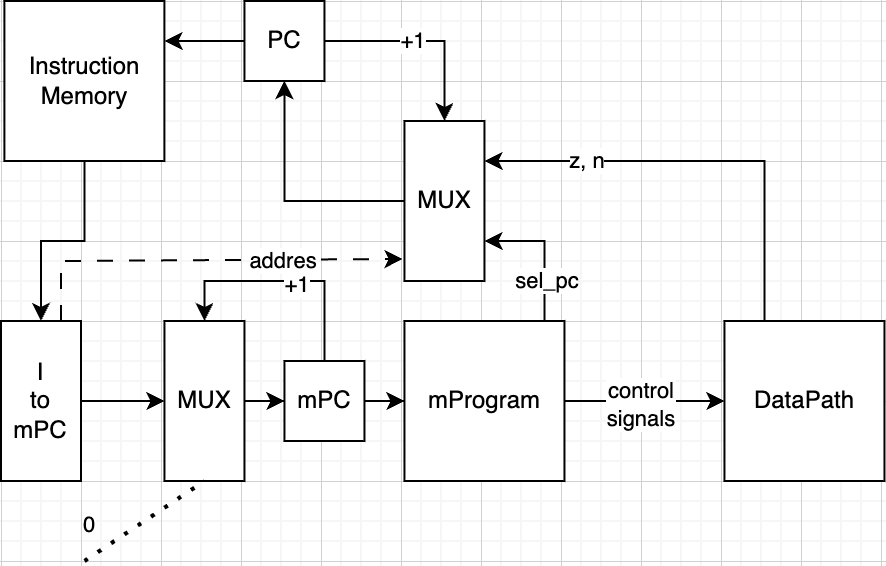
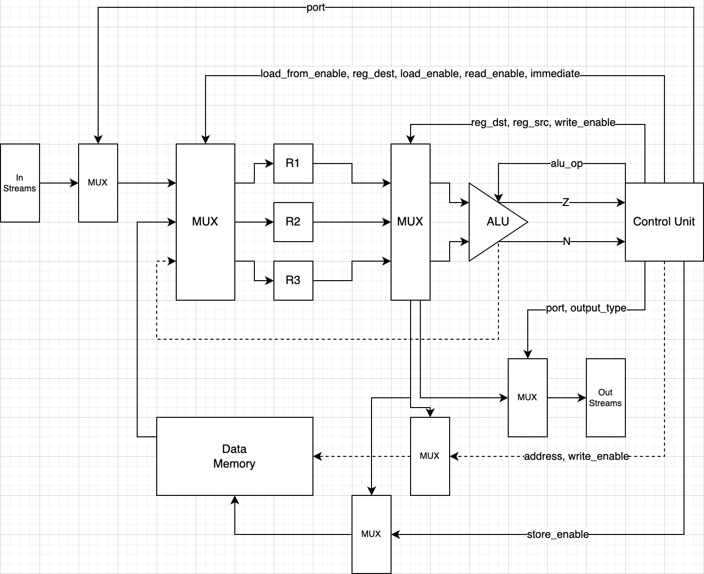

# Лабораторная работа №3. Эксперимент

- **Лукьянчук Ярослав Евгеньевич P3223**
- **Вариант:** asm, risc, harv, mc, instr, binary, stream, port, cstr, prob2

---

## SwagLang


```
<program> ::= <data_section> <text_section>

<data_section> ::= "data:" "{" {<data_definition>}* "}"

<data_definition> ::= <label> ":" <data_value> ";"

<data_value> ::= <string_literal> | <number>

<string_literal> ::= '"' {<char>}* '"'

<number> ::= <digit>+

<text_section> ::= "run" <block>

<block> ::= ":{" {<instruction>}* "}"

<instruction> ::= <label> ":" <block>
               | <label> ":"
               | <command> ";"

<command> ::= "load" "[" <reg> "," <value> "]"
           | "load" "[" <reg> "," "(" <address_from_reg> ")" "]"
           | "store" "[" <reg> "," <address> "]"
           | "store" "[" <reg> "," "(" <address_from_reg> ")" "]"
           | "input" "[" <reg> "," <stream> "]"
           | "output" "[" <reg> "," <stream> "]"
           | "inputchar" "[" <reg> "," <stream> "]"
           | "outputchar" "[" <reg> "," <stream> "]"
           | "add" "[" <reg> "," <reg_or_value> "]"
           | "sub" "[" <reg> "," <reg_or_value> "]"
           | "cmp" "[" <reg> "," <reg_or_value> "]"
           | "jmp" "[" <label> "]"
           | "je" "[" <label> "]"
           | "jn" "[" <label> "]"
           | "mod" "[" <reg> "," <reg_or_value> "]"
           | "stop"

<reg> ::= "R1" | "R2" | "R3"

<value_or_address> ::= <number> | <address>

<address> ::= <label>

<stream> ::= "!" <label>

<label> ::= <letter> [<letter> | <digit>]*

<digit> ::= "0" | "1" | "2" | "3" | "4" | "5" | "6" | "7" | "8" | "9"

<letter> ::= "a" | ... | "z" | "A" | ... | "Z"

<char> ::= <letter> | <digit> | <special_char>

<special_char> ::= "!" | "\"" | "#" | "$" | "%" | "&" | "'" | "(" | ")" | "*" | "+" | "," | "-" | "." | "/" | ":" | ";" | "<" | "=" | ">" | "?" | "@" | "[" | "\\" | "]" | "^" | "_" | "`" | "{" | "|" | "}" | "~"
```

---

## Команды

### Операции с регистрами и памятью

- `load[reg, value_or_address]`
- `store[reg, address]`
- `add[reg, reg_or_value]`
- `sub[reg, reg_or_value]`
- `cmp[reg, reg_or_value]`

### Ввод и вывод данных

- `input[reg, !stream]`
- `output[reg, !stream]`

### Работа с символами

- `inputchar[reg, !stream]`
- `outputchar[reg, !stream]`

### Переходы и метки

- `jmp[метка]`
- `je[метка]`
- `jne[метка]`
- `jg[метка]`
- `jl[метка]`
- `isneg[метка]`
- `mod[reg, reg_or_value]`
- `store_to[reg, address]`
- `stop`

---

## Семантика

### Последовательное выполнение

Команды выполняются последовательно сверху вниз, если поток управления не изменен переходами.

### Переходы

- **Безусловные (jmp):** изменяют поток выполнения без условий.
- **Условные (je, jne, jg, jl, isneg):** зависят от результата последнего `cmp`.

### Циклы

Используются метки и переходы для реализации циклов.

**Пример:**

```asm
run {
    load[R1, 0];
    input[R2, !INPUT];

    loop_start: {
        cmp[R2, 0];
        je[exit_loop];
        add[R1, 1];
        sub[R2, 1];
        jmp[loop_start];
    };

    exit_loop: {
        output[R1, !OUTPUT];
    };
}
```

---

## Области видимости

- **Регистры:** Глобальные, доступны всей программе.
- **Метки:** Глобальные, используются для переходов.
- **Память:** Глобальные переменные из секции данных.

---

## Виды литералов

### Целочисленные

Десятичные числа.

```asm
load[R1, 100];
```

### Строковые

Определяются в секции данных в двойных кавычках.

```asm
data {
    greeting: "Hello, World!";
}
```

### Идентификаторы

- **Метки:** Для переходов.
- **Потоки:** Предшествуют `!`.
- **Переменные:** В секции данных.

```asm
input[R2, !INPUT];
loop_start: { ... }
load[R1, myVar];
```

---

## Секция данных

Определяет константы и переменные.

```asm
data {
    myVar: 10;
    greeting: "Hello, World!";
}
```

- **myVar:** Число 10.
- **greeting:** Строка "Hello, World!".

---

## Микрокод

| **Микроинструкция** | **Операция**          | **Формат**                | **Описание**                                       |
|---------------------|-----------------------|---------------------------|----------------------------------------------------|
| load                | Загрузка значения     | 00001 Rdest, Число        | Загружает Число в Rdest.                           |
| store               | Сохранение в адрес    | 00011 Rsrc, Адрес         | Сохраняет из Rsrc в Адрес.                          |
| add                 | Сложение регистров    | 00100 Rdest, Rsrc         | Rdest = Rdest + Rsrc.                               |
| sub                 | Вычитание регистров   | 00101 Rdest, Rsrc         | Rdest = Rdest - Rsrc.                               |
| cmp                 | Сравнение регистров   | 00110 Rsrc1, Rsrc2        | Сравнивает Rsrc1 и Rsrc2.                           |
| jmp                 | Безусловный переход   | 00111 000000000, Адрес    | Переходит по Адрес.                                 |
| je                  | Переход если равно    | 01000 000000000, Адрес    | Переходит, если равны.                              |
| jne                 | Переход если не равно | 01001 000000000, Адрес    | Переходит, если не равны.                           |
| isneg               | Переход если отриц.   | 01001 000000000, Адрес    | Переходит, если отрицательно.                      |
| input               | Ввод числа            | 01010 Rdest, 000000000    | Вводит число в Rdest.                               |
| output              | Вывод числа           | 01011 Rsrc, 000000000     | Выводит из Rsrc.                                    |
| inputchar           | Ввод символа          | 01100 Rdest, port         | Вводит символ в Rdest.                              |
| outputchar          | Вывод символа         | 01101 Rsrc, port          | Выводит из Rsrc.                                    |
| mod                 | Остаток от деления    | 11111 Rdest, Значение      | Вычисляет остаток от деления.                        |
| stop                | Остановка программы   | 01110 000000000, 000000000 | Останавливает выполнение.                           |

**Формат инструкции (51 бит):**

- **5 бит:** Опкод
- **23 бит:** Первый операнд (Rdest)
- **23 бит:** Второй операнд (Rsrc, число или адрес)

**Примечания:**

- В `jmp`, `je`, `jne`, `jg`, `jl`, `isneg` первый операнд — 0.
- В `input`, `output`, `inputchar`, `outputchar` второй операнд — 0.
- Адреса и числа в диапазоне 0–511.

---

## Control Unit



## DataPath



---

## Таблица проектов

| **ФИО**                      | **Проект**         | **LoC** | **Code байт** | **Инстр.** | **Такт.** | **Вариант**                                      |
|------------------------------|--------------------|---------|---------------|------------|-----------|--------------------------------------------------|
| Лукьянчук Ярослав Евгеньевич | Hello, Yaroslav!   | 90      | 5610          | 110        | 422       | asm, risc, harv, mc, instr, binary, stream, port, cstr, prob2 |
| Лукьянчук Ярослав Евгеньевич | Hello, world!      | 19      | 1836          | 36         | 128       | asm, risc, harv, mc, instr, binary, stream, port, cstr, prob2 |
| Лукьянчук Ярослав Евгеньевич | Cat_some_cat       | 30      | 918           | 18         | 161       | asm, risc, harv, mc, instr, binary, stream, port, cstr, prob2 |
| Лукьянчук Ярослав Евгеньевич | Problem 2          | 87      | 3366          | 66         | 665       | asm, risc, harv, mc, instr, binary, stream, port, cstr, prob2 |
